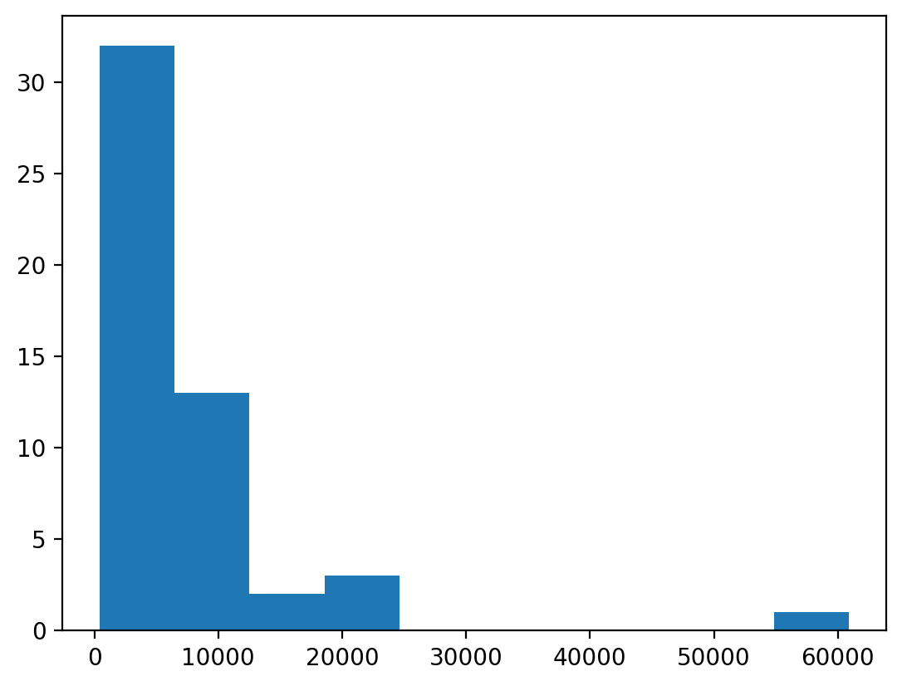
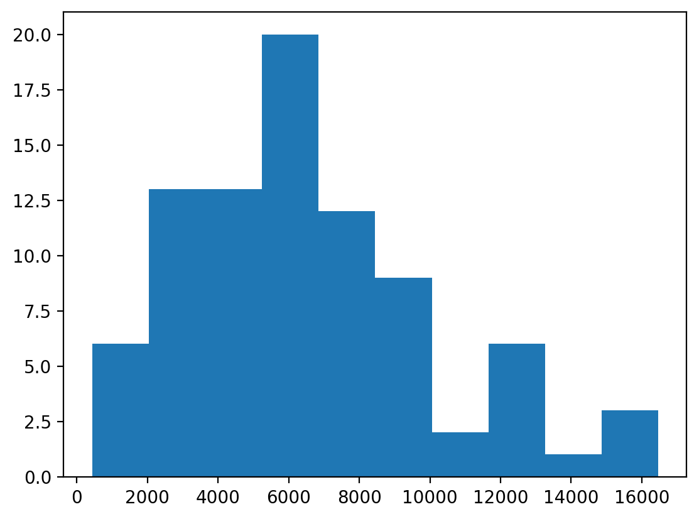

# Music Generation Transformer
## Introduction
This project use transformer architecture to produce music. Input to the model will be a sequence of 40 midi notes and the output will be prediction for the next note. 
## Data Source
The dataset that was being used was downloaded from <a href="https://colinraffel.com/projects/lmd/" target="_blank">The Lakh MIDI Dataset</a>. The model uses Clean MIDI subset.
## Data Split
Due to restriction in RAM, we had to pick a random subset of 99 songs from Clean MIDI to work with. The chosen songs are stored in <a href="https://drive.google.com/drive/folders/1ffu0J6SJt_soSpeH1jP68LV0c-MUVdV2?usp=sharing" target="_blank">Google Drive</a>. 60% are training data, 20% are validation data, and the remaining is test data. We decided to split by songs instead of tokenizing the notes, then splitting train-validation-test because we would like to make sure no song would appear in both training and test set, since several parts of a song might sound similar, and thus increase in test accuracy. This would not be a good indicator for how well our model performs on unseen data.
## Data Summary
Below is the summary of 99 songs' length initially:

Count| 99 |
--- | --- |
Mean | 8111.90 |
Std | 7468.50 |
Min | 430 |
25% | 4293 |
50%| 6161 |
75%| 9450 |
Max| 60878 |

According to the table, the weighted average song length is 8111.90 while the median of the song length is 6161. This indicates that the data is heavily right skewed, which caused by extremely large observation. Moreover, the correct measure of central tendency here is median due to the existence of extreme outliers that affected both mean and standard deviation. Therefore, we decided to remove the song whose duration is exceptionally long so that the effect of this song (if it ends up in training set) will not outweigh the effect of the majority of other songs. Before removing outliers, we would like to check the histogram:

Two methods for detecting outliers were being used were detecting outliers
by z-score and detecting outliers by IQR. In the first method, any data point having z-score above 3
or below 3 would be categorized an outlier. In the second method, any data point outside the interval
(Q1 − 1.5IQR, Q3 + 1.5IQR) is considered an outlier. However, the first method did not work since the
number of outlier based on that method is 1 only. This is due to extreme outlier that increased the
mean, and enlarged variance. The second method worked better since IQR is robust to outliers. After
looking at the outliers, every song whose length is above Q3 + 1.5IQR of all songs' length will be removed.

Below is the summary of TO BE FILLED IN songs' length after removing outliers:

Count| 85 |
--- | --- |
Mean | 6532.02 |
Std | 3533.75|
Min | 430 |
25% | 4060 |
50%| 6063 |
75%| 8439 |
Max| 16472 |

The histogram for distribution of songs' length after removing outliers is illustrated below:

## Data Transformation
## Model Figure
## Model Parameters
## Model Examples
## Training Curve
## Hyperparameter Tuning
## Quantitative Measures
Loss Cross Entropy was being used to measure the error of the model since the output is categorical (an integer from 0 to 127), and percentage of correct prediction is used as accuracy rate.
$$L_{CE} = -\sum_{i = 1}^{n}t_ilogy_i$$
$$\text{Accuracy} = \frac{\text{Number of correct predictions}}{\text{Number of data points}}$$

## Quantitative and Qualitative Results
## Justification of Results
## Ethical Consideration
Since the model learned from existing data, so if someone use the model to generate music and make
money on it, this can be thought of as using some original artists’ work without rewarding or giving
credit to them. Moreover, AI generated music would also be unfair to the artists since they had to
spent a great amount of hours to create art whereas the model learnt from them and is able to create
art at a much faster rate. Therefore, this seems to invalidate real artists’ effort.
## Author
Ali: Data transformation, provided the starting code for transformer\
Ramzi: Worked on fixing the code for positional encoding\
Minh: Data summary, write up readme file
