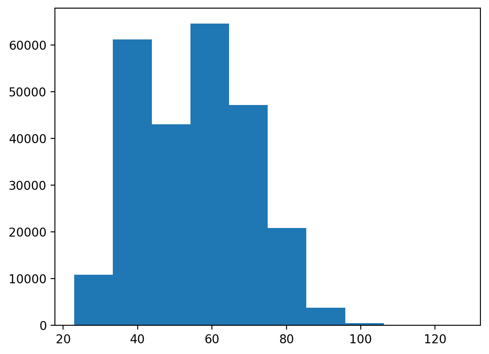

# Music Generation Transformer
## Introduction
This project use a transformer model to produce music. Transformer is a type of neural network architecture that exploits attention mechanism, and normally take a sequence of inputs and produce a sequence of output. In our project, input to the model will be a sequence of 40 midi notes and the output will be a prediction for the next note. 
## Data Source
The dataset that was being used was downloaded from <a href="https://colinraffel.com/projects/lmd/" target="_blank">The Lakh MIDI Dataset</a>. The model uses Clean MIDI subset.
## Data Split
Due to restriction in RAM, we had to pick a random subset of 51 songs from Clean MIDI to work with. The chosen songs are stored in <a href="https://drive.google.com/drive/folders/1ffu0J6SJt_soSpeH1jP68LV0c-MUVdV2?usp=sharing" target="_blank">Google Drive</a>. 60% are training data, 20% are validation data, and the remaining is test data. We decided to split by songs instead of tokenizing the notes, then splitting train-validation-test because we would like to make sure no song would appear in both training and test set, since several parts of a song might have the same melody, and thus increase in test accuracy. This would not be a good indicator for how well our model performs on unseen data.
## Data Summary
Below is the summary of 99 songs' length initially:

Count| 51 |
--- | --- |
Mean | 7683.37 |
Std | 9038.92 |
Min | 430 |
25% | 3548.5 |
50%| 5360 |
75%| 8489 |
Max| 60878 |

According to the table, the weighted average song length (number of notes in a song) is 7683.37 while the median of the song length is 5360. This indicates that the data is heavily right skewed, which caused by extremely large observation. Moreover, the correct measure of central tendency here is median due to the existence of extreme outliers that affected both mean and standard deviation. Therefore, we decided to remove the song whose duration is exceptionally long so that the effect of this song (if it ends up in training set) will not outweigh the effect of the majority of other songs. Before removing outliers, we would like to check the histogram:

Two methods for detecting outliers were being used were detecting outliers
by z-score and detecting outliers by IQR. In the first method, any data point having z-score above 3
or below 3 would be categorized an outlier. In the second method, any data point outside the interval
(Q1 − 1.5IQR, Q3 + 1.5IQR) is considered an outlier. However, the first method did not work since the
number of outlier based on that method is 1 only. This is due to extreme outlier that increased the
mean, and enlarged variance. The second method worked better since IQR is robust to outliers. After
looking at the outliers, every song whose length is above Q3 + 1.5IQR of all songs' length will be removed.

Below is the summary of 46 songs' length after removing outliers:

Count| 46 |
--- | --- |
Mean | 5473.34 |
Std | 3038.59|
Min | 430 |
25% | 3446 |
50%| 5036 |
75%| 7173 |
Max| 12890 |

The histogram for distribution of songs' length after removing outliers is illustrated below:

Moreover, we should also look at the distribution for frequency of notes. This is because in the end, we would like to make sure our model performs at least better than a model always predicting the most frequent note. The mode (most frequent MIDI note) is 42, and the histogram of note frequency distribution is shown below:

## Data Transformation

Since there are 128 possible notes on a MIDI device, and they range from 0 to 127, we created one hot vector with 128 entries.For example, a middle C is a note number 60 will be denoted by number 1 at index 60 and 0 everywhere else. Moreover, a note 0 never appears in any of the song, so we used a note 0 (numbered 1 at the first index and 0 everywhere else) to indicate the end of a song. 

We first fetch every note from a specific song, then we form sequences of 40 notes each as inputs to our model, and the note immediately the $40^{th}$ note is used as ground truth. For example, one valid pair of input-output is (($1^{st}$ note, $2^{nd}$ note,..., $40^{th}$ note), $41^{st}$ note).

Next, we convert each note in our input into one hot vector. Therefore, we have $40$ notes $\times$ $128$ entries per note = 5120 entries for one input data point. We implement the above process for every training points in our training set. 

## Model Figure

Our transformer is a bit different than the standard transformer since we only output one note due to restricted computational resource. The number of times the encoder and decoder got repeated is TO BE FILLED IN NUMBER OF LAYERS.However, if the project is replicated to produce sequence of notes instead of one note, we can parsed in predicted output to the decoder and use masked multi head attention with a layer "Add and Norm" to combine with output from encode. 

Below is further details for Multihead Attention layer and Add and Norm layer:

For Multihead attention layer, the input is the output of model input embedding and position encoding layers, which give (Number of samples, Sequence Length, Embedding Size) shaped matrix. There are three distinct linear layers for query, key, and value since they have their own weights.

The add step is a residual connection $F(x) + x$, and followed by normalization layer.

The Linear layer is just applied the following formula
$$z = Wx + b$$

Softmax layer is the implementation of the following formula
$$y_i = \dfrac{e^{z_i}}{\sum e^{z_j}}$$

Then the predicted output would be the category that receives highest probability.
## Model Parameters

Below is the summary of number of parameters in our model:

Layer| Number of parameter |
--- | --- |
Input layer | 0 |
Layer Normalization | 256|
Positional Encoding| 0 |
MultiHead Attention | 131968 |
Add| 0 |
Normalization| 257|
Dense| 16512|
Add| 0 |
Normalization| 257|
MultiHead Attention | 131968 |
Add| 0 |
Normalization| 257|
Dense| 16512|
Add| 0 |
Normalization| 257|
MultiHead Attention | 131968 |
Add| 0 |
Normalization| 257|
Dense| 16512|
Add| 0 |
Normalization| 257|
MultiHead Attention | 131968 |
Add| 0 |
Normalization| 257|
Dense| 16512|
Add| 0 |
Normalization| 257|
Global Average Pooling | 0
Drop out | 0
Dense | 16512
Total number of params | 612744
Trainable Params | 610688
Non-trainable params (from normalization): 2056

## Model Examples

The first example is from test set and the model predicted correctly:

INSERT GROUND TRUTH

INSERT MODEL PREDICTION

The second example is from test set and the model predicted incorrectly:

INSERT GROUND TRUTH

INSERT MODEL PREDICTION

## Training Curve

Below is the training curve of our final model where blue line represents performance on training set and orange represents model performance on validation set:

## Hyperparameter Tuning

Our hyperparameter is .... We tuned the hyperparameters by running the model with NUMBER OF different combinations of hyperparmeters that includes learning rate, batch size, number of epochs.

## Quantitative Measures

Loss function that was being used is loss cross entropy
$$L_{CE} = \sum_{i=1}^{N} t_i \log{y_i}$$
$$\text{Accuracy} = \frac{\text{Number of correct predictions}}{\text{Number of data points}}$$

## Quantitative and Qualitative Results

The final model training accuracy is 39% with training loss of 2.1662

The final model validation accuracy is 12.2% with validation loss of 3.5861

The test accuracy is 14.97%.

## Justification of Results

Suppose there is a model that always predict the most frequent note (42), then the test accuracy of the hypothetical model is 6% as illustrated in our code.

Therefore, the result obtain from our transformer model is acceptable. Moreover, predicting music is a difficult task since music depends on the artist, and different artist might have their own style, let alone if different music genre will have different melody. It is difficult to capture the pattern in art work since it offers lots of freedom and creativity. Moreover, the model was trained on mostly pop music, which means there is no guarantee the model will work well on other genres such as blues. The project can be extended to be a model whose input is sequence of notes, and output sequence of notes (until end of song) as well. This might be a better use of transformer since it makes use of decoder architecture that being parsed in the predicted output to generate even more notes. However, due to restricted computational resource, we could only build a model that predicts the next note given a sequence of 40 notes.

## Ethical Consideration
Since the model learned from existing data, so if someone use the model to generate music and make
money on it, this can be thought of as using some original artists’ work without rewarding or giving
credit to them. Moreover, AI generated music would also be unfair to the artists since they had to
spent a great amount of hours to create art whereas the model learnt from them and is able to create
art at a much faster rate. Therefore, this seems to invalidate real artists’ effort.

## Author
Ali: Data transformation, provided the starting code for transformer\
Ramzi: Worked on fixing the code for positional encoding\
Minh: Data exploration, write up readme file

## References
- Lab 5 from CSC311 Fall 2022
